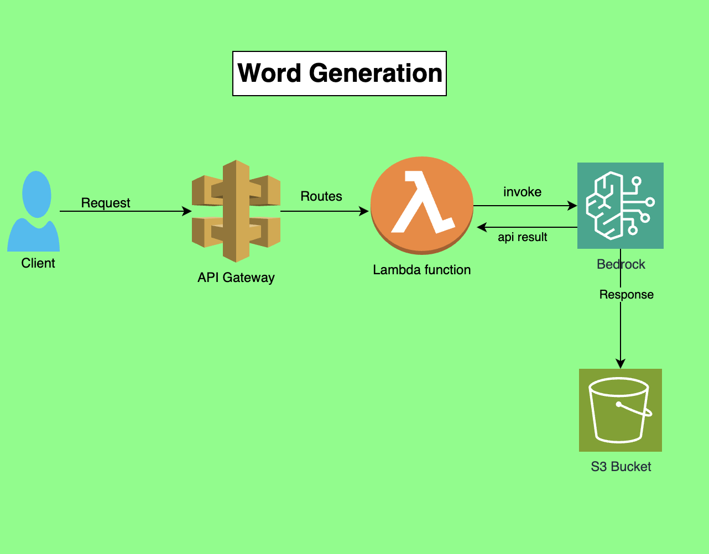

# bedrock_vocab
This will be using bedrock to generate vocab and stores it in dynamodb
##SYSTEM DESIGN

## Setup
1. Python
2. sam cli
3. Docker
4. AWS account

## How to run
1. Clone the repo
2. Run `sam build`
3. Run `sam deploy --guided`
4. Run `sam local invoke`

## How to test
1. Run `sam build`
